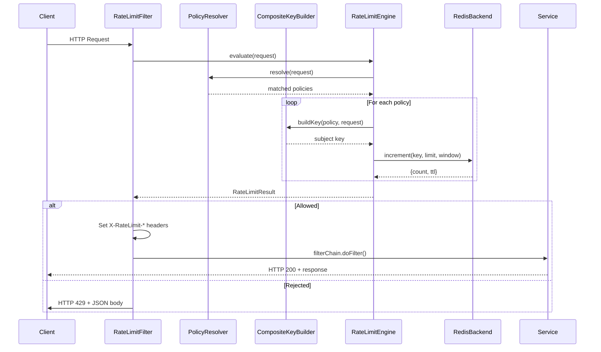

# Architecture

## Component Overview

```
┌──────────────────────────────────────────────────────────────────────┐
│                        Spring Boot Application                       │
│                                                                      │
│  ┌──────────────────┐  ┌──────────────────┐  ┌───────────────────┐  │
│  │  RateLimitFilter  │─▶│  RateLimitEngine  │─▶│     Backend       │  │
│  │  (Filter)         │  │  (Orchestrator)   │  │  (Redis / Memory) │  │
│  └────────┬─────────┘  └────────┬─────────┘  └───────────────────┘  │
│           │                     │                                    │
│           │             ┌───────┴────────┐                           │
│           │             │                │                           │
│  ┌────────▼─────────┐  ┌▼──────────────┐ ┌▼────────────────────┐   │
│  │ RateLimitMetrics  │  │ PolicyResolver │ │ CompositeKeyBuilder  │   │
│  │ (Micrometer)      │  │ (AntPath)      │ │ (Extractors)        │   │
│  └──────────────────┘  └────────────────┘ └─────────────────────┘   │
│                                                                      │
└──────────────────────────────────────────────────────────────────────┘
```

## Sequence Diagram



## Data Flow

### Request Processing Pipeline

```
1. HTTP Request arrives
   │
2. RateLimitFilter.doFilterInternal()
   │
3. RateLimitEngine.evaluate()
   ├── PolicyResolver.resolve()
   │   ├── Filter enabled policies
   │   ├── Match path (AntPathMatcher)
   │   ├── Match method
   │   └── Sort by priority
   │
   ├── For each matched policy:
   │   ├── CompositeKeyBuilder.buildKey()
   │   │   ├── IpExtractor.extract()
   │   │   ├── UserExtractor.extract()
   │   │   ├── ApiKeyExtractor.extract()
   │   │   ├── TenantExtractor.extract()
   │   │   └── RouteExtractor.extract()
   │   │
   │   ├── Compute window: floor(now / windowSeconds)
   │   ├── Build Redis key: rl:{policyId}:{subject}:{window}
   │   │
   │   └── Backend.increment()
   │       ├── Execute Lua script (INCR + EXPIRE)
   │       └── Return {count, ttl}
   │
   └── Aggregate results
       ├── Any rejected? → return shortest retry-after
       └── All allowed? → return lowest remaining
   │
4. Decision
   ├── ALLOW → set headers, continue filter chain
   └── REJECT → 429 + JSON body + Retry-After header
```

### Redis Key Lifecycle

```
Time: 14:30:00 (window start)
  │
  ├── First request:  INCR rl:policy:ip:1.2.3.4:1485  → 1
  │                   EXPIRE rl:policy:ip:1.2.3.4:1485 65
  │
  ├── 2nd request:    INCR → 2
  ├── 3rd request:    INCR → 3
  ├── ...
  ├── Nth request:    INCR → N (if N > limit → REJECT)
  │
Time: 14:31:00 (next window)
  │
  ├── New key:        INCR rl:policy:ip:1.2.3.4:1486  → 1
  │
Time: 14:31:05
  │
  └── Old key expires (TTL=65s) → automatic cleanup
```

## Deployment Topology

### Single Instance (Development)

```
┌──────────┐     ┌───────┐
│ App      │────▶│ Redis │
│ (in-mem) │     │       │
└──────────┘     └───────┘
```

### Multi-Instance (Production)

```
                    ┌──────────┐
            ┌──────▶│ App #1   │──────┐
            │       └──────────┘      │
┌────────┐  │       ┌──────────┐      │    ┌───────┐
│  Load  │──┼──────▶│ App #2   │──────┼───▶│ Redis │
│Balancer│  │       └──────────┘      │    │       │
└────────┘  │       ┌──────────┐      │    └───────┘
            └──────▶│ App #3   │──────┘
                    └──────────┘

All instances share Redis → global rate limit enforcement
```

## Design Principles

| Principle | How It's Applied |
|---|---|
| **Deterministic decisions** | Same request at same time always produces same allow/reject decision |
| **Minimal runtime overhead** | Single Redis round trip per policy; no complex computations in the hot path |
| **Framework-agnostic policy model** | Policies are YAML data, not annotations or code; can be loaded from any source |
| **Observability-first** | Every decision is metered (Prometheus) and logged (structured SLF4J) |
| **Safe failure semantics** | Fail-open by default; Redis outage does not cascade to application outage |
| **Pluggable components** | Backend, subject extractors, and algorithms are interfaces with swappable implementations |
