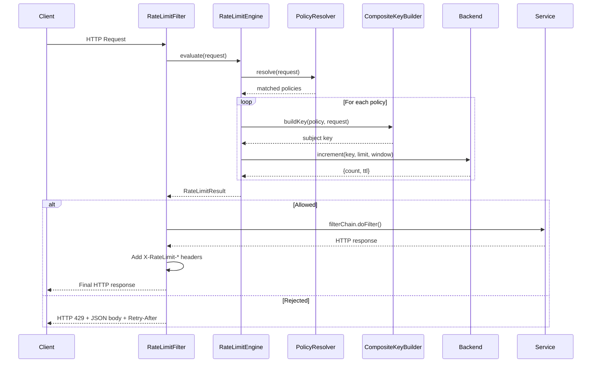

# Architecture

## Component Overview

```
┌───────────────────────────────────────────────────────────────────────┐
│                        Spring Boot Application                        │
│                                                                       │
│  ┌───────────────────┐  ┌────────────────────┐  ┌───────────────────┐ │
│  │  RateLimitFilter  │─▶│  RateLimitEngine   │─▶│     Backend       │ │
│  │  (HTTP concerns)  │  │  (Orchestrator)    │  │  (Redis / Memory) │ │
│  └────────┬──────────┘  └─────────┬──────────┘  └───────────────────┘ │
│           │                       │                                   │
│           │              ┌────────┴─────────┐                         │
│           │              │                  │                         │
│  ┌────────▼──────────┐  ┌▼───────────────┐ ┌▼────────────────────┐   │
│  │ RateLimitMetrics  │  │ PolicyResolver │ │ CompositeKeyBuilder │   │
│  │ (Micrometer)      │  │ (AntPath)      │ │ (Extractors)        │   │
│  └───────────────────┘  └────────────────┘ └─────────────────────┘   │
│                                                                       │
└───────────────────────────────────────────────────────────────────────┘
```

### Component Responsibilities

| Component | Responsibility |
|---|---|
| **RateLimitFilter** | Middleware entry point. Handles HTTP-specific concerns: invokes engine, renders rate limit headers on allowed responses, returns 429 JSON body on rejections. |
| **RateLimitEngine** | Orchestrates per-policy evaluation. Resolves policies, builds keys, calls backend, and aggregates results into a single decision. Does not own business logic for matching, extraction, or storage. |
| **PolicyResolver** | Resolves which policies apply to a given request by matching path (Ant patterns) and HTTP method. Returns policies sorted by priority for deterministic processing order. |
| **CompositeKeyBuilder** | Builds the canonical subject key from request context by invoking registered `SubjectExtractor` implementations and joining their results. |
| **Backend** | Atomically updates and reads usage state. Owns counter increment, TTL management, and window isolation. Two implementations: `RedisBackend` (distributed, wrapped in Resilience4j circuit breaker) and `InMemoryBackend` (local/dev). |
| **RateLimitMetrics** | Records Prometheus counters (requests, allowed, rejected, errors) and evaluation duration timer. |
| **PolicyReloadService** | Manages runtime policy updates. Holds a thread-safe `AtomicReference` of active policies. Supports hot-reload without restart. |
| **PolicyReloadEndpoint** | Actuator endpoint (`/actuator/ratelimiter`). GET to view active policies, POST to trigger reload from configuration. |
| **CircuitBreaker** | Resilience4j circuit breaker wrapping all Redis calls in `RedisBackend`. Prevents cascading failures when Redis is unavailable. Transitions: CLOSED → OPEN (50% failure rate) → HALF_OPEN (probe after 10s). |
| **RateLimitInterceptor** | Spring MVC interceptor for `@RateLimit` annotation-based rate limiting. Evaluates annotation policies alongside YAML policies. |
| **RateLimitHeaderAdvice** | `ResponseBodyAdvice` that ensures `X-RateLimit-*` headers are present on all responses, including error responses from controllers. |

## Sequence Diagram



## Data Flow

### Request Processing Pipeline

```
1. HTTP Request arrives
   │
2. RateLimitFilter.doFilterInternal()
   │
3. RateLimitEngine.evaluate()
   ├── PolicyResolver.resolve()
   │   ├── Filter enabled policies
   │   ├── Match path (AntPathMatcher)
   │   ├── Match method
   │   └── Order by priority for deterministic processing
   │
   ├── For each matched policy:
   │   ├── CompositeKeyBuilder.buildKey()
   │   │   ├── IpExtractor.extract()
   │   │   ├── UserExtractor.extract()
   │   │   ├── ApiKeyExtractor.extract()
   │   │   ├── TenantExtractor.extract()
   │   │   └── RouteExtractor.extract()
   │   │
   │   ├── Compute window: floor(epoch_seconds / windowSeconds)
   │   ├── Build key: rl:{policyId}:{subject}:{window}
   │   │
   │   └── Backend.increment()
   │       ├── Execute Lua script (INCR + EXPIRE)
   │       └── Return {count, ttl}
   │
   └── Aggregate results
       ├── Any rejected? → return most restrictive (shortest retry-after)
       └── All allowed? → return most restrictive (lowest remaining quota)
   │
4. Decision
   ├── ALLOW → continue filter chain, add rate limit headers to response
   └── REJECT → 429 + JSON body + Retry-After header
```

**Decision semantics:** when multiple policies allow the request, response headers are derived from the most restrictive matched policy, defined as the policy with the lowest remaining quota after evaluation. When multiple policies reject, the one with the shortest `retryAfter` is returned to give the client the earliest retry opportunity.

### Backend Contract

For each evaluated policy, the backend must atomically:

1. **Increment** the active counter for the given key
2. **Initialize TTL** if the key is newly created (`EXPIRE` on first `INCR`)
3. **Return** the current count and remaining window TTL

The backend is responsible for window isolation — each `{policy, subject, window_start}` tuple maps to exactly one counter. The engine computes `allowed = (count <= limit)` and `remaining = max(0, limit - count)` from the backend response.

### Redis Key Lifecycle

```
Time: 14:30:00 (window_start = floor(1742046600 / 60) = 29034110)
  │
  ├── 1st request:   INCR rl:login-per-ip:ip:1.2.3.4:29034110  → 1
  │                  EXPIRE rl:login-per-ip:ip:1.2.3.4:29034110 65
  │
  ├── 2nd request:   INCR → 2
  ├── 3rd request:   INCR → 3
  ├── ...
  ├── Nth request:   INCR → N  (if N > limit → REJECT)
  │
Time: 14:31:00 (window_start = 29034111)
  │
  ├── New key:       INCR rl:login-per-ip:ip:1.2.3.4:29034111  → 1
  │
Time: 14:31:05
  │
  └── Old key expires (TTL = window + 5s buffer) → automatic cleanup
```

### Route Normalization

Routes are matched using normalized path patterns rather than raw request URLs. This prevents unbounded key cardinality and keeps policy evaluation consistent across requests.

| Raw Request URI | Normalized / Matched As |
|---|---|
| `/api/payments/` | `/api/payments` (trailing slash stripped) |
| `/api/payments/abc` | Matched by pattern `/api/payments/**` |
| `/api/payments/abc/refunds` | Matched by pattern `/api/payments/**` |

Policy matching uses Spring's `AntPathMatcher` for glob patterns. The `RouteExtractor` builds subject keys from `METHOD:path` (e.g., `POST:/api/payments/abc`), while `PolicyResolver` normalizes paths before matching.

## Failure Semantics

If backend evaluation fails (Redis connection error, timeout, unexpected exception):

| Mode | Behavior |
|---|---|
| **Fail-open** (default) | Request is allowed. Warning logged. `rate_limiter_errors_total` metric incremented. |
| **Fail-closed** | Request is rejected immediately. |

In both modes:
- Backend errors **never** propagate as unhandled exceptions to the application request pipeline
- Errors are always observable via metrics and logs
- The filter continues to function for subsequent requests (no circuit-breaking state in v1)

## Deployment Topology

### Local Development (in-memory backend)

```
┌──────────┐
│   App    │
│ (memory) │
└──────────┘
```

No external dependencies. Counters are process-local.

### Local Development (Redis backend)

```
┌──────────┐     ┌───────┐
│   App    │────▶│ Redis │
│ (redis)  │     │       │
└──────────┘     └───────┘
```

### Multi-Instance Production

```
                    ┌──────────┐
            ┌──────▶│ App #1   │──────┐
            │       └──────────┘      │
┌────────┐  │       ┌──────────┐      │    ┌───────┐
│  Load  │──┼──────▶│ App #2   │──────┼───▶│ Redis │
│Balancer│  │       └──────────┘      │    │       │
└────────┘  │       ┌──────────┐      │    └───────┘
            └──────▶│ App #3   │──────┘
                    └──────────┘

All instances share Redis → global rate limit enforcement
```

## Extensibility

The architecture is intentionally layered so features can be added without redesigning the core flow:

| Extension Point | Interface / Mechanism | Example |
|---|---|---|
| New algorithms | `RateLimitBackend` implementation | Token bucket, sliding window |
| New backends | `RateLimitBackend` implementation | Memcached, database |
| New subject types | `SubjectExtractor` implementation | JWT claim, geo-region |
| Policy modes | `Policy.mode` field | `observe` (shadow mode), `enforce` |
| Config sources | `RateLimiterProperties` | Database, API, config server |

## Design Principles

| Principle | How It's Applied |
|---|---|
| **Deterministic evaluation** | Policy evaluation follows deterministic aggregation rules; backend atomicity preserves correctness under concurrency |
| **Minimal runtime overhead** | Single Redis round trip per policy; no complex computations in the hot path |
| **Configuration-driven policies** | Policy definitions are YAML data, not coupled to controller annotations or endpoint code |
| **Observability-first** | Every decision is metered (Prometheus) and logged (structured SLF4J) |
| **Safe failure semantics** | Fail-open by default; backend errors are contained and observable, never cascading |
| **Pluggable components** | Backend, subject extractors, and algorithms are interfaces with swappable implementations |
